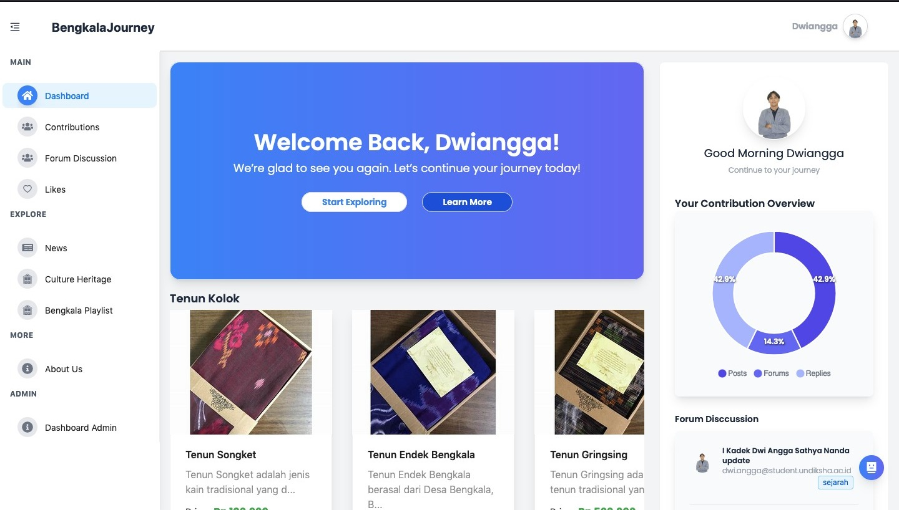

# 🌿 BengkalaJourney

 <!-- Ganti dengan path gambar screenshot website kamu -->

**BengkalaJourney** adalah sebuah platform digital interaktif yang dirancang untuk memperkenalkan potensi budaya serta kehidupan masyarakat Desa Bengkala secara lebih mendalam melalui pendekatan teknologi.

> ✨ _Satu Klik, Seribu Cerita Bengkala._

---

## 📌 Tujuan Proyek

- Mendokumentasikan dan menyebarluaskan potensi budaya Desa Bengkala secara digital.
- Memberikan ruang partisipasi kepada masyarakat melalui kontribusi konten.
- Menjadi sumber informasi edukatif dan aktual terkait Bengkala.

---

## 🚀 Fitur Utama

### 👥 Umum (Pengunjung/Masyarakat)

- 📸 **Contributions** – Pengguna dapat mengunggah konten berupa foto kegiatan, budaya, atau momen di Bengkala.
- 💬 **Forum Diskusi** – Ruang terbuka untuk berdiskusi seputar isu atau topik menarik terkait Bengkala.
- 📰 **Berita** – Informasi terbaru seputar desa, kegiatan, dan event.
- 🧏‍♂️ **Kebudayaan** – Penjelasan mendalam tentang budaya unik masyarakat Kolok.
- 🧵 **Kain Tenun** – Eksplorasi potensi UMKM lokal, terutama tenun khas Bengkala.
- 🎶 **Playlist YouTube** – Video-video yang menampilkan aktivitas dan potensi desa dari kanal YouTube terkait.
- 📄 **About Us** – Informasi tentang tim pengembang dan tujuan platform ini.

### 🔐 Admin

- 📊 **Dashboard Admin** – Panel kontrol untuk mengelola kontribusi pengguna, berita, playlist, forum, dan konten lainnya.

---

## 🛠️ Teknologi yang Digunakan

- **Frontend**:

  - [React.js](https://reactjs.org/)
  - [Tailwind CSS](https://tailwindcss.com/)
  - [Ant Design](https://ant.design/)

- **Backend**:

  - [Golang (Go)](https://golang.org/) – sebagai layanan REST API

- **Deployment & Tools**:
  - GitHub
  - Figma / Canva _(untuk desain UI/UX)_

---

## 📁 Struktur Direktori (Frontend)

```bash
bengkalajourney/
├── public/
├── src/
│   ├── components/
│   ├── pages/
│   ├── Providers/
│   ├── services/       # Berisi API services dengan Go backend
│   ├── store/
│   ├── utils/
│   ├── App.jsx
│   ├── index.css
│   └── main.jsx
├── .gitignore
├── eslint.config.js
├── index.html
├── package-lock.json
├── package.json
├── postcss.config.js
├── tailwind.config.js
├── vite.config.js
└── README.md
```
